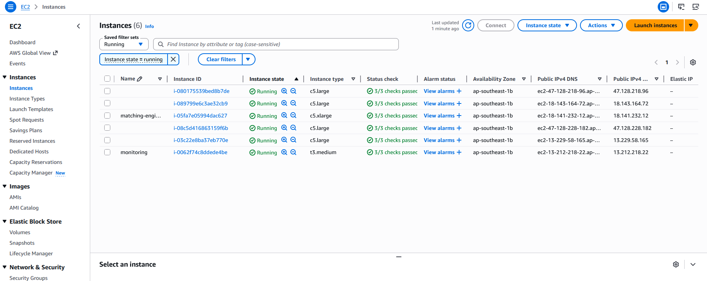
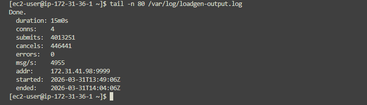
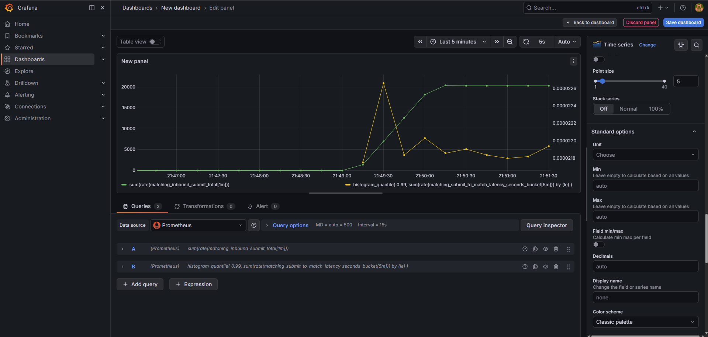
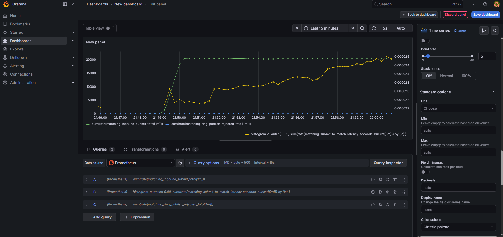

# Low-Latency Order Matching Engine

Java matching engine (single symbol, limit + market) targeting **1M orders/sec** and **p99 &lt; 10 µs**. Built with LMAX Disruptor, Netty, and Kafka for trade-event replay.

- **[docs/DESIGN.md](docs/DESIGN.md)** — architecture, threads, trade-offs
- **[docs/RUNBOOK.md](docs/RUNBOOK.md)** — build, Docker Kafka, run, verify

## Requirements

- **JDK 21** (LTS) to run Gradle and build the project. The app is compiled for Java 21.
- Gradle 8.10+ (wrapper included)

## Build & run

**Use JDK 21 when running Gradle** (required):

- **Option A — set JAVA_HOME** (recommended):  
  Point `JAVA_HOME` to JDK 21, then run Gradle:

  ```bash
  # Windows (PowerShell)
  $env:JAVA_HOME = "C:\Program Files\Java\jdk-21"
  .\gradlew.bat build

  # Windows (CMD)
  set JAVA_HOME=C:\Program Files\Java\jdk-21
  gradlew.bat build
  ```

- **Option B — force in project**:  
  In `gradle.properties`, set (use your actual JDK 21 path):
  ```properties
  org.gradle.java.home=C:/Program Files/Java/jdk-21
  ```

Then:

```bash
# Build and test
./gradlew build

# Run the application (placeholder)
./gradlew run
```

On Windows use `gradlew.bat` instead of `./gradlew`.

### Microbenchmarks (JMH + HdrHistogram)

Run with **JDK 21** and a **quiet machine** (close heavy apps, plug in power on laptops) for stable numbers:

```bash
./gradlew jmh          # Linux / macOS
.\gradlew.bat jmh      # Windows
```

Benchmarks live under **`src/jmh/java/engine/bench/`**:

- **`OrderBookThroughputBench`** — JMH **throughput** of crossing limit-order submits on the in-process **`OrderBook`** (not Netty, not Disruptor, not Kafka). Use it to compare JVM flags or code changes on the same box.
- **`OrderBookHdrLatencyBench`** — JMH **SampleTime** plus an **HdrHistogram** built from `System.nanoTime()` around each `submit` in the measured loop. A **manual warmup** in `@Setup` JITs the path before recording; **`@TearDown(Level.Trial)`** prints **`outputPercentileDistribution`** so you get tail behavior in one place.

**Interpreting output:** JMH’s summary table (throughput ops/s or sample mean ns/op) is for regression-style A/B tests on _your_ hardware. The printed Hdr table is **per trial** (aggregated over measurement iterations for that benchmark). Absolute µs targets stated above are **not** guaranteed by these microbenchmarks—they isolate the matcher, not the full ingress/pipeline. Raw text is also written to **`build/results/jmh/results.txt`**.

### Throughput and latency on your machine (Prometheus / Grafana)

The engine exposes Micrometer metrics on **`http://localhost:8081/metrics`** by default (override with **`METRICS_PORT`** or **`-Dmetrics.port`**). To graph them locally, run Prometheus (e.g. **`docker compose up`** in this repo — see [docs/RUNBOOK.md](docs/RUNBOOK.md)), point it at the engine, generate load (`./gradlew run` plus [scripts/send_orders.py](scripts/send_orders.py) or [scripts/simulate_market.py](scripts/simulate_market.py)), then use **PromQL** in the Prometheus UI or paste the same expressions into a **Grafana** panel (Prometheus datasource).

**Orders per second (all submit types combined):**

```promql
sum(rate(matching_inbound_submit_total[1m]))
```

`[1m]` is a one-minute sliding window for `rate()`; you can use `[5m]` for a smoother line.

**Approximate p99 latency (ring publish → match), in seconds:** Micrometer timers export histogram buckets with a **`_seconds`** suffix — use the names you see on `/metrics` if yours differ.

```promql
histogram_quantile(
  0.99,
  sum(rate(matching_submit_to_match_latency_seconds_bucket[5m])) by (le)
)
```

`histogram_quantile` expects **non-negative** rates; if this returns nothing, confirm the scrape target is **UP**, the histogram series exists (open `/metrics` and search for `matching_submit_to_match_latency`), and submits are actually occurring (`rate` needs counters to change over the window).

**Throughput by side and order type** (Micrometer may expose labels as `order_type` rather than `orderType`):

```promql
sum by (side, order_type) (rate(matching_inbound_submit_total[1m]))
```

## Layout

- `src/main/java/engine/` — core engine (matching, Disruptor, Netty, Kafka sink)
- `src/main/resources/` — config placeholder
- `src/test/java/` — unit and integration tests
- `src/jmh/java/engine/bench/` — JMH benchmarks (HdrHistogram where noted)

## Kafka trade sink (optional)

When **`KAFKA_BOOTSTRAP_SERVERS`** or **`-Dkafka.bootstrap.servers`** is set, trades are sent asynchronously:

- Matching thread only **offers** each `TradeEvent` to a bounded queue (non-blocking).
- Daemon thread **`kafka-trade-sender`** serializes (48-byte big-endian longs) and calls `KafkaProducer.send`.
- If the queue is full, trades are **dropped**; see `AsyncKafkaTradeSink#droppedTrades()` for a future metric.

| Env / property                                                | Default         |
| ------------------------------------------------------------- | --------------- |
| `KAFKA_BOOTSTRAP_SERVERS` / `kafka.bootstrap.servers`         | (off if unset)  |
| `KAFKA_TRADES_TOPIC` / `kafka.trades.topic`                   | `engine-trades` |
| `KAFKA_TRADES_QUEUE_CAPACITY` / `kafka.trades.queue.capacity` | `65536`         |

Payload: `tradeId, price, quantity, makerOrderId, takerOrderId, timestampNanos` (each `long`, big-endian).

## AWS observability & chaos experiment (Terraform)

This section documents my real cloud experiment: deploying the engine on **AWS (ap-southeast-1, Singapore)**, generating sustained TCP load from multiple clients, and observing throughput + tail latency in **Prometheus + Grafana**.

### What I built

- **Engine node (on-demand)**: runs `engine.app.MatchingEngineApp`
  - TCP ingress: `:9999`
  - Prometheus metrics: `:8081/metrics`
- **Load generators (Spot)**: run a Go TCP load generator (`scripts/loadgen`) firing random SUBMIT/CANCEL frames
- **Monitoring node (on-demand)**: self-hosted **Prometheus + Grafana** (Docker Compose), scraping the engine

Infrastructure lives in `infra/` (Terraform). User-data bootstraps each instance (install deps, clone repo, build, start services).

### Architecture

```text
┌──────────────────────────────────────────── VPC (default) ────────────────────────────────────┐
│                                                                                               │
│  ┌─────────────┐     TCP :9999     ┌────────────────────┐                                     │
│  │  loadgen-*   │ ───────────────▶ │                    │                                     │
│  │  (Spot EC2)  │                  │  matching-engine   │ :8081/metrics                       │
│  └─────────────┘                  │  (Netty + Disruptor│ ◀──── scrape ──── ┌──────────────┐  │
│                                   │   + OrderBook)     │                    │  monitoring   │  │
│                                   └────────────────────┘                    │  Prometheus   │  │
│                                                                             │  Grafana :3000│  │
│                                                                             └──────────────┘  │
└───────────────────────────────────────────────────────────────────────────────────────────────┘
```

### Settings




- Number of load generators: 4
- Duration: 15 minutes
- Rate: 5000 messages per second per load generator
- Connections per load generator: 4
- Cancel percentage: 10%

### Running the experiment

Prepare the infrastructure:
- your key pair on ec2 region
- your public ip

```bash
cd infra
cp terraform.tfvars.example terraform.tfvars
# Edit: key_name + my_ip

terraform init
terraform apply
```

- `terraform output grafana_url`
- `terraform output prometheus_url`
- `terraform output engine_metrics_url`


### What I observed

- **Throughput**
```promql
sum(rate(matching_inbound_submit_total[1m]))
```

- **Latency (p99 submit→match)**
```promql
histogram_quantile(
  0.99,
  sum(rate(matching_submit_to_match_latency_seconds_bucket[5m])) by (le)
)
```

- **Backpressure / ring publish rejects**
```promql
sum(rate(matching_ring_publish_rejected_total[1m]))
```

- **Monitor Heap Memory Usage**
```promql
jvm_memory_used_bytes{area="heap"}
```

- **Monitor GC Pauses (if GC1 is used, ZGC rarely use it)**
```promql
jvm_gc_pause_seconds_max
```

- **Grafana dashboard**


- **As Expected, throughput is hovering around 20,000 TPS (5000 for each load generator)**


One thing to note is that the latency keep going up from time to time, and it's not stable.
Initial thought is that the orderbook are keep growing leading to larger memory allocation and GC pressure.
But the number of trades match seems go linear with it, so not sure the orderbook are really growing.


## Wire protocol (TCP ingress)

Binary, big-endian. Send to the engine port (default 9999).

- **SUBMIT** (type `0`): 1 + 8 + 1 + 8 + 8 + 1 + 8 = 35 bytes: type, orderId, side (0=BUY 1=SELL), price, quantity, orderType (0=LIMIT 1=MARKET), timestampNanos.
- **CANCEL** (type `1`): 1 + 8 = 9 bytes: type, orderId.

## Key dependencies

| Purpose        | Library                                         |
| -------------- | ----------------------------------------------- |
| Event pipeline | LMAX Disruptor                                  |
| Network I/O    | Netty                                           |
| Trade sink     | Kafka clients                                   |
| Metrics        | Micrometer + Prometheus                         |
| Latency stats  | HdrHistogram (JMH bench + optional runtime use) |
| Benchmarks     | JMH (`jmh` source set, Champeau plugin)         |

## Final thoughts

I put **1M orders/sec** and **p99 &lt; 10 µs** in the README because they gave me a north star, not because this repo proves either one end-to-end. After actually building and measuring, what I learned is that those numbers are almost never “one trick” outcomes—they are **contracts on a boundary**: whose order rate you count (wire? matcher only?), where the clock starts and stops, which percentile window you trust, and what hardware you are allowed to assume. A JMH run on `OrderBook` can look amazing on a good day and still say almost nothing about TCP, the JVM waking a blocked thread, GC, or a noisy cloud neighbor eating your tail.

The **cost** to get close to that kind of SLO for real is not just smarter Java. It is pinned cores, boring metal (or the right instance family and a lot of $$), dialing GC and allocations until the hot path stops begging for pause, questioning every timer and every `List` allocation, and then proving it again under load that looks like production—not a microbench. The **effort** is weeks to months of profiling and discipline, and often a willingness to rewrite the hottest bits or the networking layer entirely. I am nowhere near that here, and I do not want to pretend otherwise.

This project is still **far** from the target in any honest sense: single-symbol toy book, comfort-structure APIs, metrics on the hot path, blocking waits where a serious system might spin and burn CPU, no serious threat model, no matching the long checklist a real venue runs. Even if I optimized every decision I have made so far, there would still be a **gap**, because the gap is not only code—it is operations, hardware, and scope. **That is fine.** The whole point for me was **learning**: to touch Disruptor and Netty and Kafka and Prometheus in one small story, and to understand why production matching engines are built the way they are. If you are evaluating this like a product, please don’t—it is a **learning project**, not something I would ship as actual production matching infrastructure.
